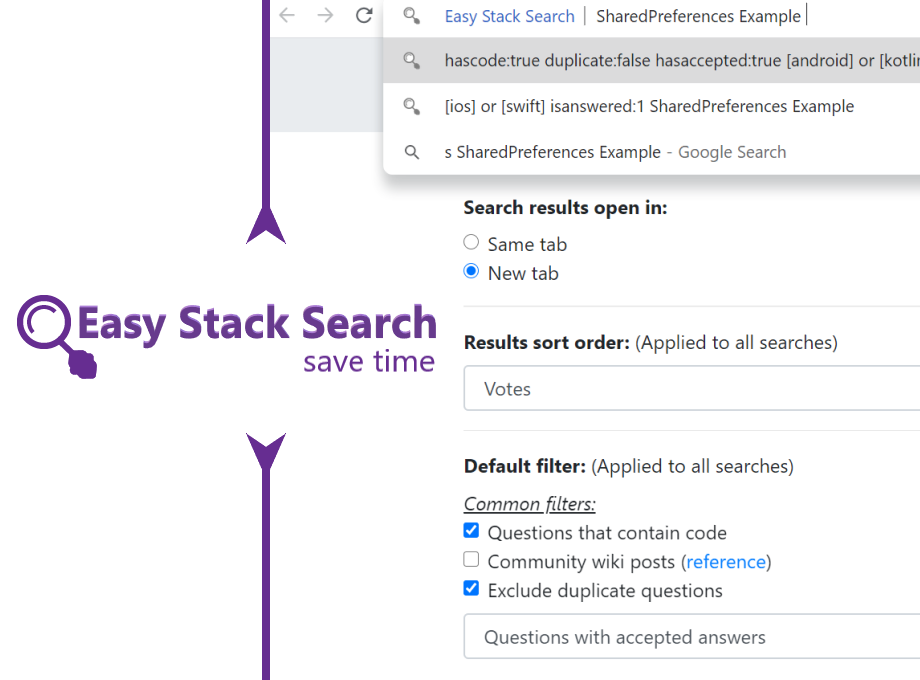

  

Easy Stack Search is a lightweight extension that makes searching Stack sites like StackOverflow quick & easy.

## Supported browsers
| Browser | Version |
| :-: | :-: |
| [Google Chrome](https://chrome.google.com/webstore/detail/easy-stack-search/clcbdgojnikjpnplbflmmckolehpenil?hl=en-GB&authuser=0) | Chrome 35+ |
| Microsoft Edge | Edge 79+ |

## Feature list:
1. Use "s" Omnibox command to search in stackoverflow from address-bar. 
 For example - Type "s", press space/tab, then type "SharedPreferences" and press enter to bring up the search results for "SharedPreferences" in Stack Overflow.

2. Search any text you select using (right-click) context menu.

3. Choose whether search result is shown in same tab or new tab.

4. Set the sort order of the search results.

5. Set default filters to be applied to all searches.

6. Add additional filters that will be shown as omnibox suggestions.

7. Change default URL to search other sites.
