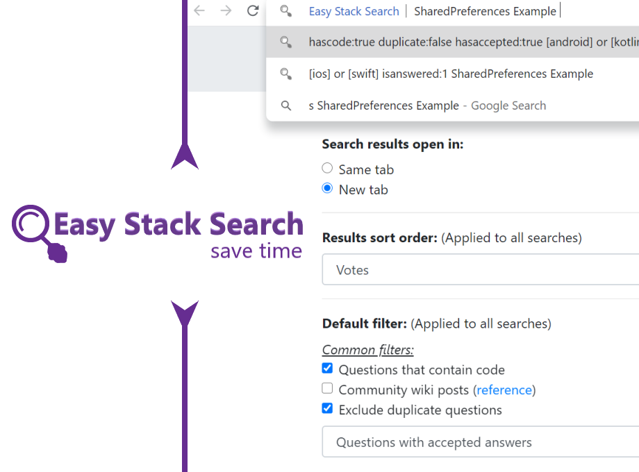

<p align="center">
  
</p>

Easy Stack Search is a lightweight extension that makes searching Stack sites like StackOverflow quick & easy.

## Supported browsers
| Browser | Version |
| :-: | :-: |
| [Google Chrome](https://chrome.google.com/webstore/detail/easy-stack-search/clcbdgojnikjpnplbflmmckolehpenil?hl=en-GB&authuser=0) | Chrome 35+ |
| [Mozilla Firefox](https://addons.mozilla.org/en-US/firefox/addon/easy-stack-search/) | Firefox 52+ |
| [Microsoft Edge](https://microsoftedge.microsoft.com/addons/detail/easy-stack-search/knoepfamajmogacbinpkanmenheepbpf) | Edge 79+ |
| Opera | All versions |

## Feature list:
1. Use "s" Omnibox command to search in stackoverflow from address-bar. 
<br>For example - Type "s", press space/tab, then type "SharedPreferences" and press enter to bring up the search results for "SharedPreferences" in Stack Overflow.

2. Search any text you select using (right-click) context menu.

3. Choose whether search result is shown in same tab or new tab.

4. Set the sort order of the search results.

5. Set default filters to be applied to all searches.

6. Add additional filters that will be shown as omnibox suggestions.

7. Change default URL to search other sites.

<b>NOTE:</b> To avoid any CAPTCHA blockades, sign into your StackExchange account.

## Bugs and Feedback
For bugs, suggestions and questions please use [Github Issues](https://github.com/Chrisvin/EasyStackSearchExtension/issues).

## License
```
MIT License

Copyright (c) 2019 Jem

Permission is hereby granted, free of charge, to any person obtaining a copy
of this software and associated documentation files (the "Software"), to deal
in the Software without restriction, including without limitation the rights
to use, copy, modify, merge, publish, distribute, sublicense, and/or sell
copies of the Software, and to permit persons to whom the Software is
furnished to do so, subject to the following conditions:

The above copyright notice and this permission notice shall be included in all
copies or substantial portions of the Software.

THE SOFTWARE IS PROVIDED "AS IS", WITHOUT WARRANTY OF ANY KIND, EXPRESS OR
IMPLIED, INCLUDING BUT NOT LIMITED TO THE WARRANTIES OF MERCHANTABILITY,
FITNESS FOR A PARTICULAR PURPOSE AND NONINFRINGEMENT. IN NO EVENT SHALL THE
AUTHORS OR COPYRIGHT HOLDERS BE LIABLE FOR ANY CLAIM, DAMAGES OR OTHER
LIABILITY, WHETHER IN AN ACTION OF CONTRACT, TORT OR OTHERWISE, ARISING FROM,
OUT OF OR IN CONNECTION WITH THE SOFTWARE OR THE USE OR OTHER DEALINGS IN THE
SOFTWARE.
```
